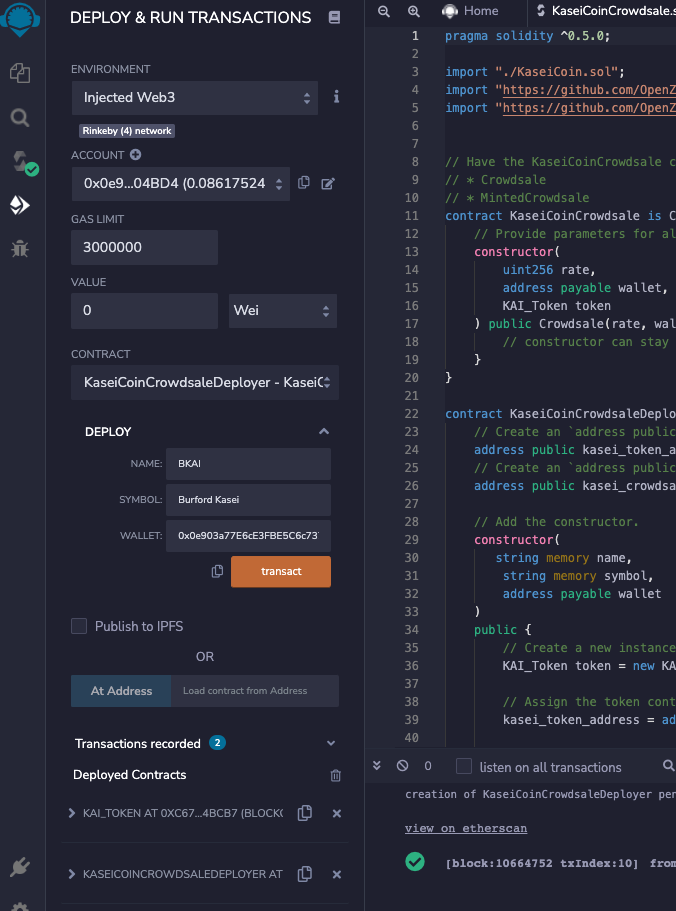
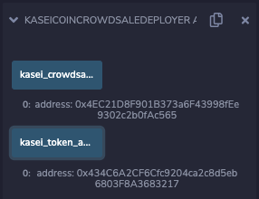
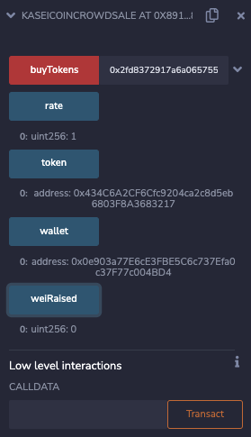
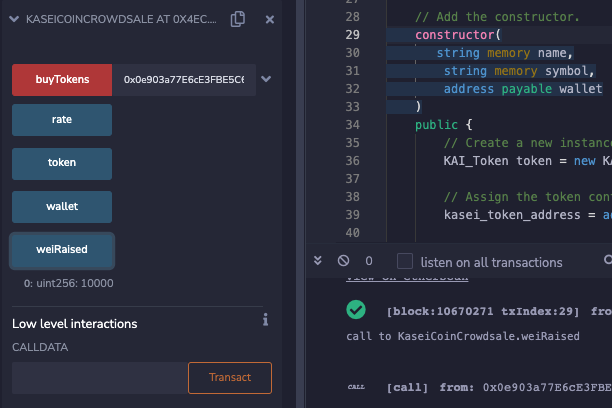
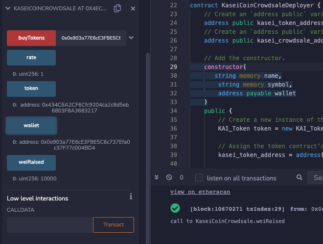

# Smart_Contract_KaseiCoin_Crowdsale
Develop, Deploy and Test a Crowdsale Smart Contract on a Local Blockchain

## Background - Martian Token Crowdsale

The concept of this Smart Contract project is the development of a new monetary system for a hypothetical Mars colony. The monetary system will be base on blockchain technology, with an associated cryptocurrency named **KaseiCoin**. (Kasei means Mars in Japanese.)

KaseiCoin will be a fungible token that’s ERC-20 compliant. We intend to launch a crowdsale that will allow people who are "moving" to Mars to convert their earthling fiat money to KaseiCoin.

## Solidity Code Files

The following files are associated with the KaseiCoin project:

[KaseiCoin.sol](./Solidity_Code/KaseiCoin.sol)

[KaseiCoinCrowdsale.sol](./Solidity_Code/KaseiCoinCrowdsale.com)

## OpenZeppelin

The following OpenZeppelin Contracts/Libraries imported or inherited for the KaseiCoin project:

    * `ERC20`

    * `ERC20Detailed`

    * `ERC20Mintable`
    
    * `Crowdsale`

    * `MintedCrowdsale`

## Project Objectives

The following subsections will be performed to complete the project:

1. Develop a KaseiCoin Token Contract - smart contract that defines KaseiCoin as an ERC-20 token.

2. Develop a KaseiCoin Crowdsale Contract - the crowdsale contract will manage the entire crowdsale process. This process will allow users to send ether to the contract and receive KaseiCoin tokens, or **KAI**, in return. The contract will automatically mint the tokens and distribute them to a buyer in one transaction.

3. Develop a KaseiCoin Deployer Contract - The Crowdsale will be deployed to a local blockchain by using Remix, MetaMask, and Ganache.

4. Deploy and Test the Crowdsale on a Local Blockchain - Deployment and testing results contained in **Evaluation Evidence** section.

## Evaluation Evidence

### 1. Compile the contracts by using Remix.

* Successful Compile of KaseiCoin.sol

* Successful Compile of KaseiCoinCrowdsale.sol Minter Contract

* Successful Compile of KaseiCoinCrowdsale.sol Deployer Contract

### 2. Deploy and Test the crowdsale to a local blockchain by using Remix, MetaMask, and Ganache.

* Successful Deploy of KaseiCoinCrowdsale.sol Deployer Contract

* Kasei Crowdsale Address and Token Address

2. Test the functionality of the crowdsale by using test accounts to buy new tokens and then checking the balances of those accounts.

* Crowdsale Launch, ready to buy Tokens

* Balance of Account that purchased the crowdsale token

3. Review the total supply of minted tokens and the amount of wei that the crowdsale contract has raised.

* Total supply of minted tokens the crowdsale has raised

---
